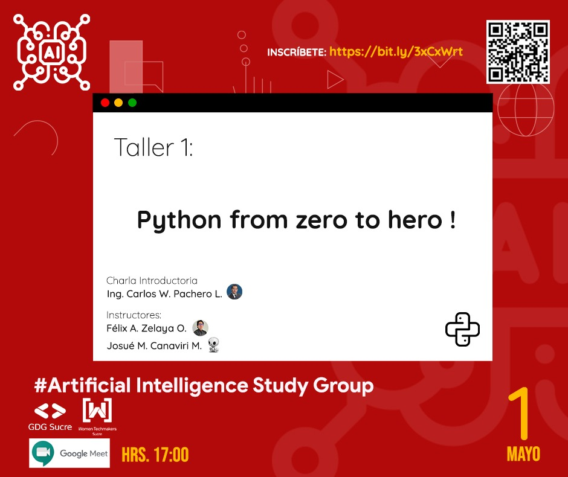

# Programacion Orientada a Objetos con Python

Este proyecto contiene los ejemplos de programacion orientada a objetos dados en el segundo taller de:
> Python from Zero to Hero

El cual esta organizado de la siguiente manera:

* Introducción Teórica [POO en Python](./python-oop.md)
* Nuestra primera clase [poo.py](./poo.py)
* La clase Vehiculo [vehiculo.py](./vehiculo.py)
* La clase Punto(Point) [point.py](./point.py)
* La clase Vector2D [vector2d.py](./vector2d.py)
* Usando nuestras clases en otros archivos [use_vector](./use_vector.py)
