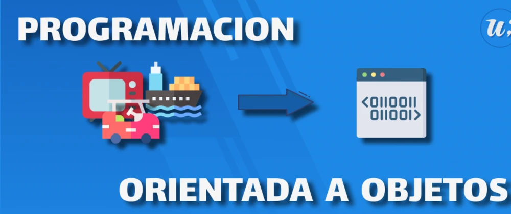
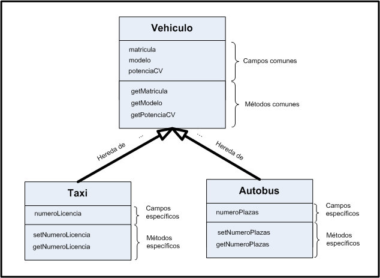

# Programación Orientada a Objetos en Python


En Python todo es un objeto y debe ser manipulado y usado como tal.
La Programación Orientada a Objetos (POO u OOP por sus siglas en inglés), es un
paradigma de programación.

> Paradigma: Teoría cuyo núcleo central [...] suministra la base y modelo para resolver problemas [...] 

> Definición de la Real Academia Española, vigésimo tercera edición

Definicion Informal _Es la forma en la que resolvemos un problema_

# Y que es un objeto?

Un objeto es una __cosa__ y esta cosa es un sustantivo es un objeto

# Pero como describimos un objeto???
Describir un objeto, es simplemente mencionar sus cualidades. Las cualidades son adjetivos. Ejemplo:
* El _objeto_ es verde
* El _objeto_ es grande

Describiendo las caracteristicas de los objetos. Ejemplo:
* El _objeto_ es verde
    * Que es verde? - Es un color
* El _objeto_ es grande
    * Que es grande? - Es un tamaño

Y a su ves tales objetos tienen o pueden realizar ciertas acciones:
* El _objeto_ puede lanzarce
* El _objeto_ arranca

# Clases
```python
class ClassName:
    pass
```
Las clases son los modelos sobre los cuáles se construirán nuestros objetos.
> PEP 8: clases
> El nombre de las clases se define en singular, utilizando
> CamelCase.

# Atributos
```python
class ClassName:
    def __init__(self, value1, value2, value_n):
        self.value1 = value1
        self.value2 = value2
        self.value_n = value_n
```

# Métodos
```python
class ClassName:
    def foo(self, params):
        pass
```
> Notar que el primer parámetro de un método, siempre
> debe ser self.

# Objeto e Instancia
Las clases por sí mismas, no son más que modelos que nos servirán para crear objetos
en concreto. Podemos decir que una clase, es el razonamiento abstracto de un objeto,
mientras que el objeto, es su materialización. A la acción de crear objetos, se la denomina
“instanciar una clase” y dicha instancia, consiste en asignar la clase, como valor a una
variable:
```python 
class ClassName:
    def foo(self):
        pass
instance = ClassName()
instance.foo()
```

# Herencia:
Es una característica principal de la POO, algunos objetos comparten las mismas propiedades y métodos que otro objeto, y además agregan nuevas propiedades y métodos. A esto se lo denomina herencia: una clase que hereda de otra. 
Vale aclarar, que en Python, cuando una clase no hereda de ninguna otra, debe hacerse heredar de
object, que es la clase principal de Python, que define un objeto.


Ejemplo de herencia
```python
class BaseClass:
    pass

class ChildClass(BaseClass):
    pass
```
